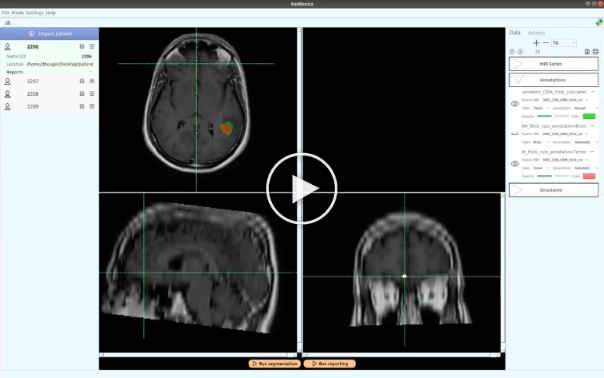

<div align="center">

<h1 align="center">Raidionics</h1>
<h3 align="center">Open software for AI-based pre- and postoperative brain tumor segmentation and standardized reporting</h3>

[](https://github.com/SINTEFMedtek/FAST-Pathology/releases)
[](https://opensource.org/licenses/BSD-2-Clause)
[](https://doi.org/10.1038/s41598-023-42048-7)
 
**Raidionics** was developed by SINTEF Medical Image Analysis. A paper presenting the software and some benchmarks has been published in [Scientific Reports](https://doi.org/10.1038/s41598-023-42048-7).
 
 
</div>

## [Getting started](https://github.com/raidionics/Raidionics#getting-started)

* Please visit the [wiki](https://github.com/dbouget/Raidionics/wiki) to know more about usage, use-cases, and access tutorials.
* For any issue, please report them [here](https://github.com/dbouget/Raidionics/issues).
* Frequently asked questions (FAQs) can be found [here](https://github.com/dbouget/Raidionics/wiki/Frequently-Asked-Questions-(FAQ)).

## [Installation](https://github.com/raidionics/Raidionics#installation)
An installer is provided for the three main Operating Systems: Windows (v10, 64-bit), Ubuntu Linux (>= 18.04), macOS (>= 10.15 Catalina), and macOS ARM (M1/M2 chip).
The software can be downloaded from [here](https://github.com/dbouget/Raidionics/releases) (see **Assets**).

**NOTE:** For reinstallation, it is recommended to _manually delete_ the `.raidionics/` folder located inside your home directory.

These steps are only needed to do once:
1) Download the installer to your Operating System.
2) Right click the downloaded file, click "open", and follow the instructions to install.
3) Search for the software "Raidionics" and double click to run.

## [Demos and tutorials](https://github.com/raidionics/Raidionics/demos-and-tutorials)

Very simple demonstrations of the software can be found on [Youtube](https://www.youtube.com/@davidbouget5649). Wikis and tutorials can be found in the [wiki](https://github.com/dbouget/Raidionics/wiki).

[](https://www.youtube.com/watch?v=cm9Mxg7Fuj8)

## [Continuous integration](https://github.com/raidionics/Raidionics/continuous-integration)

| Operating System | Status |
| - | - |
| **Windows** |  |
| **Ubuntu** |  |
| **macOS** |  |

## [How to cite](https://github.com/raidionics/Raidionics#how-to-cite)
If you are using Raidionics in your research, please cite the following references.

For the preliminary preoperative tumor segmentation validation and software features:
```
@article{bouget2022preoptumorseg,
    title={Preoperative Brain Tumor Imaging: Models and Software for Segmentation and Standardized Reporting},
    author={Bouget, David and Pedersen, André and Jakola, Asgeir S. and Kavouridis, Vasileios and Emblem, Kyrre E. and Eijgelaar, Roelant S. and Kommers, Ivar and Ardon, Hilko and Barkhof, Frederik and Bello, Lorenzo and Berger, Mitchel S. and Conti Nibali, Marco and Furtner, Julia and Hervey-Jumper, Shawn and Idema, Albert J. S. and Kiesel, Barbara and Kloet, Alfred and Mandonnet, Emmanuel and Müller, Domenique M. J. and Robe, Pierre A. and Rossi, Marco and Sciortino, Tommaso and Van den Brink, Wimar A. and Wagemakers, Michiel and Widhalm, Georg and Witte, Marnix G. and Zwinderman, Aeilko H. and De Witt Hamer, Philip C. and Solheim, Ole and Reinertsen, Ingerid},
    journal={Frontiers in Neurology},
    volume={13},
    year={2022},
    url={https://www.frontiersin.org/articles/10.3389/fneur.2022.932219},
    doi={10.3389/fneur.2022.932219},
    issn={1664-2295}
}
```

The final software including updated performance metrics for preoperative tumors and introducing postoperative tumor segmentation:
```
@article{article,
    author = {Bouget, David and Alsinan, Demah and Gaitan, Valeria and Holden Helland, Ragnhild and Pedersen, André and Solheim, Ole and Reinertsen, Ingerid},
    year = {2023},
    month = {09},
    pages = {},
    title = {Raidionics: an open software for pre-and postoperative central nervous system tumor segmentation and standardized reporting},
    volume = {13},
    journal = {Scientific Reports},
    doi = {10.1038/s41598-023-42048-7},

}
```
